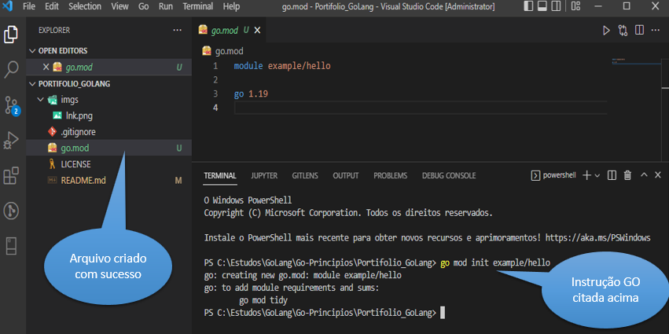
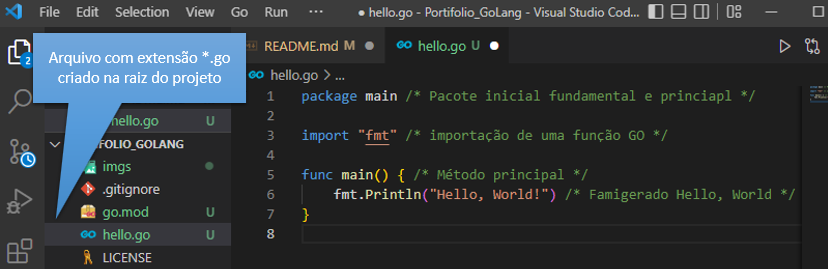
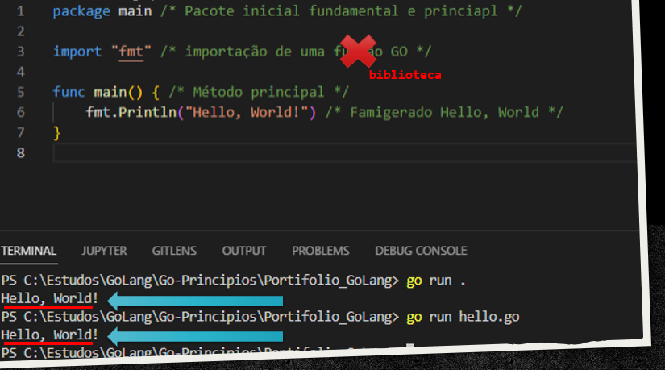

# Go Lang

[](https://github.com/wesloy/Portifolio_S.O.L.I.D/blob/main/license)

## Sobre o projeto

Este projeto tem por base desvendar e aplicar conceitos da linguagem _GoLang_.  
Irei conceituar características do _Go_ e aplicar durante a construção de uma API de controles de leitura de documentos.

**Observação**: toda palavra seguida de asterisco, possui uma breve descrição na penúltima sessão deste _Redme_, sessão _Glossário_, com o objetivo de elucidar quaisquer dúvidas sobre a utilização do termo no contexto deste artigo.  
Exemplo: Glossário\*

## Go Lang

Uma linguagem desenvolvida pelo Google, open source* e tem como objetivo tornar o programador mais eficiente, rápido e produtivo.  
Linguagem limpa, baixa curva de apredizagem, madura e simples. A Go já foi criada com foco multicore* e multiplataforma* ela é estaticamente tipada*, com baixa verbosidade* e precisa ser compilada*, mas o resultado é um único arquivo.

### Instalação

https://go.dev/ sendo este o site oficial, pode-se baixar o instalador para qualquer das 3 plataformas comuns de sistemas operacionais: Linux, Mac ou Windows.  
A instalação segue aquele "burocrático" procedimento: Next, next e finish. Easy-peasy!

### Hello World

O "go.mod" é um arquivo gerado com o comando destacado abaixo e este arquivo gerencia todas as dependências importadas para o projeto, bem como as dependências que poderão ser criadas no projeto em que você estiver "codando".  
Atualmente o "go.mod" também contem a localização/caminho do repositório do código fonte que está sendo desenvolvido, podendo ser a raiz do servidor onde será feito o deploy ou um repositório do github, que aliás é o que mais se é feito, principalmente se a intenção é publicar para que outros possam usufruir da aplicação criada.

Após criar a pasta onde o projeto será desenvolvido e acessar a mesma através do seu prompt de comando, digite a seguinte instrução:

```DOS
go mod init example/hello
```

O comando "go mod init" é do Go Lang, já o sufixo "example/hello" é o que se foi explicado acima, ou seja, o endereço principal que sua aplicação adotará, que muitas vezes é o nome do repositório git.  



Após a criação e inicialização do projeto, precisamos *codar* o esperado ___Hello World___.  
Para isso, precisamos criar um arquivo com extensão *.go e inserir as instruções necessárias para exibir a mensagem.  

  

A sintaxe da imagem é esta:  

```go
package main 

import "fmt" 

func main() { 
	fmt.Println("Hello, World!") 
}
```

Até mesmo como a imagem mostra, nos comentários inseridos no código, temos alguns elementos importantíssimos para um _Dev Go_. São eles:  

- ***package main***: ou pacote principal/essencial. Todo "package" é um aglotinador de métodos, arquivos e funções. Neste caso, em específico, o pacote principal do projeto.  
- ***import fmt***: trata-se de uma das várias bibliotecas que o GO fornece em sua instalação de forma padrão. O _fmt_ é uma biblioteca que fornece formatações, até mesmo a possibilidade de imprimir em tela um texto, método que usamos em nosso exemplo.  
- ***func main***: a função principal/fundamental, como em outras linguagens (C# ou Java) é necessária para iniciar a execução do programa, sem ela não é possível se rodar a aplicação.  

Agora é fazer a mágica acontecer!  
Vamos executar nosso projeto e dar um "Olá mundo!".  
Para isso, vamos abrir o terminal e usar o seguinte comando:  

```go
go run .
```
 Deixando o próprio Go encontrar o arquivo que contem a estrutura principal (Main).  
 Pode-se especificar o arquivo a ser executado, com o comando abaixo:  
 ```go
go run hello.go
```



## Links Úteis / Referências

- [Documentação oficial Go Lang](https://go.dev/)  
- [Canal Youtube - Wesley Willians - Go Lang do Zero](https://www.youtube.com/watch?v=_MkQLDMak-4&list=PL5aY_NrL1rjucQqO21QH8KclsLDYu1BIg)  


## Glossário

- **Glossário** - dicionário de palavras de sentido obscuro ou pouco conhecido; elucidário.
- **Estaticamente Tipada** - quando a pessoa que está programando precisa informar explicitamente o tipo de cada dado utilizado no sistema.
- **Multiplataforma** - mais de 1 sistema operacional pode rodar a aplicação. Exemplo: Linux, Mac ou Windows.
- **Multicore** - contém pelo menos 2 núcleos de processamento.
- **Open Source** - código aberto, onde os usuários podem contribuir para a sua evolução e utilzar para qualquer fim.
- **Verbosidade** - necessário gerar muito código para que um processo seja executado.

## Autor

> **Wesley Eloy**  
> Bacharel em Administração  
> Pós graduado em Tecnologias de aplicações Web  
> Atuando como Desenvolvedor  
> [Linkdin (wesley-eloy)](https://www.linkedin.com/in/wesley-eloy/)


