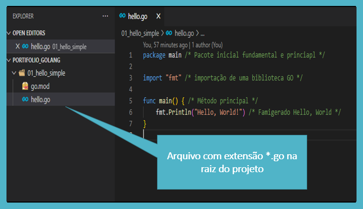

# Go Lang

[](https://github.com/wesloy/Portifolio_S.O.L.I.D/blob/main/license)

## Sobre o projeto

Este projeto tem por base desvendar e aplicar conceitos da linguagem _Go Lang_.  
Irei conceituar características do _Go_ e aplicar durante a construção de uma API de controles de leitura de documentos.

**Observação**: toda palavra seguida de asterisco, possui uma breve descrição na penúltima sessão deste _Redme_, sessão _Glossário_, com o objetivo de elucidar quaisquer dúvidas sobre a utilização do termo no contexto deste artigo.  
Exemplo: Glossário\*

## Go Lang

Uma linguagem desenvolvida pelo Google, open source* e tem como objetivo tornar o programador mais eficiente, rápido e produtivo.  
Linguagem limpa, baixa curva de apredizagem, madura e simples. A Go já foi criada com foco multicore* e multiplataforma* ela é estaticamente tipada*, com baixa verbosidade* e precisa ser compilada*, mas o resultado é um único arquivo.

### Instalação

https://go.dev/ sendo este o site oficial, pode-se baixar o instalador para qualquer das 3 plataformas comuns de sistemas operacionais: Linux, Mac ou Windows.  
A instalação segue aquele "burocrático" procedimento: Next, next e finish. Easy-peasy!

### Hello World

O "go.mod" é um arquivo gerado com o comando destacado abaixo e este arquivo gerencia todas as dependências importadas para o projeto, bem como as dependências que poderão ser criadas no projeto em que você estiver "codando".  
Atualmente o "go.mod" também contem a localização/caminho do repositório do código fonte que está sendo desenvolvido, podendo ser a raiz do servidor onde será feito o deploy ou um repositório do github, que aliás é o que mais se é feito, principalmente se a intenção é publicar para que outros possam usufruir da aplicação criada.

Após criar a pasta onde o projeto será desenvolvido e acessar a mesma através do seu prompt de comando, digite a seguinte instrução:

```DOS
go mod init example/hello
```

O comando "go mod init" é do Go Lang, já o sufixo "example/hello" é o que se foi explicado acima, ou seja, o endereço principal que sua aplicação adotará, que muitas vezes é o nome do repositório git.  


Após a criação e inicialização do projeto, precisamos *codar* o esperado ___Hello World___.  
Para isso, precisamos criar um arquivo com extensão *.go e inserir as instruções necessárias para exibir a mensagem.  

  

A sintaxe da imagem é esta:  

```go
	package main 

	import "fmt" /* Importado de uma biblioteca GO */

	func main() { 
		fmt.Println("Hello, World!") 
	}
```

Até mesmo como a imagem mostra, nos comentários inseridos no código, temos alguns elementos importantíssimos para um _Dev Go_. São eles:  

- ***package main***: ou pacote principal/essencial. Todo "package" é um aglotinador de métodos, arquivos e funções. Neste caso, em específico, o pacote principal do projeto.  
- ***import fmt***: trata-se de uma das várias bibliotecas que o GO fornece em sua instalação de forma padrão. O _fmt_ é uma biblioteca que fornece formatações, até mesmo a possibilidade de imprimir em tela um texto, método que usamos em nosso exemplo.  
- ***func main***: a função principal/fundamental, como em outras linguagens (C# ou Java) é necessária para iniciar a execução do programa, sem ela não é possível se rodar a aplicação.  

Agora é fazer a mágica acontecer!  
Vamos executar nosso projeto e dar um "Olá mundo!".  
Para isso, vamos abrir o terminal e usar o seguinte comando:  

```go
	go run .
```
 Deixando o próprio Go encontrar o arquivo que contem a estrutura principal (Main).  
 Pode-se especificar o arquivo a ser executado, com o comando abaixo:  
 ```go
	go run hello.go
```

  

### Chamar códigos de um arquivo externo/diferente  


Até aqui vimos o *Hello World*, sendo executado dentro do arquivo principal e dentro da função principal, denominada *Main*. Mas não seria razoável pensar em "codar" todo um sistema/projeto em um único arquivo, então se faz necessário entender como podemos chamar códigos de um *package* diferente, que esteja dentro de um arquivo externo ao *Main* (Principal).  

**Imagem 01**


Na **Imagem 01** foi dado destaque a estrutura de uma função em arquivos distintos, os passos para codar o que está nesta imagem são:  

- Primeiramente o "go mod init", que já citamos acima, deve iniciar com um endereço Git ou de pastas que você está codando. Depois montamos o arquivo principal, como no "Hello World" exemplificado no tópico anterior, que nesta **Imagem 01** foi nomeado como "main.go".
- Agora nos resta criar um arquivo à parte com a função que se pretende rodar, porém é preciso detida atenção neste momento, para entender o jeto Go de estruturar arquivos externos.
  
**Imagem 02**

  

- Na **Imagem 02** podemos observar que o "_package_" é formado quando criamos uma subpasta e dentro dela criamos o arquivo com extensão *.go.  Para exemplificação criamos o arquivo "hello.go" e "bye.go" eles possuem como "cabeçalho" o "package mensages" o que não é uma coincidência com o nome da subpasta, mas sim o jeto Go de marcar sua estrutura de relacionamento de arquivos, **veja na imagem abaixo**. Neste ponto, chamo a atenção ao seguinte fato: as duas funções poderiam estar dentro de um mesmo arquivo. Separei em arquivos distintos para mostrar que para o Go o que importa é a estrutura de pasta e a marcação _package_ de nome similar, neste exemplo, denominado _mensages_. Assim sendo, podemos concluir que a quantidade de arquivos abaixo da subpasta/package fica a critério de organização do desenvolvedor e não de uma exigência da linguagem.

  

- Agora para chamar esse pacote que criamos, vá até o arquivo _Main_ e inclua nas importações o endereço completo. Lembrando que o endereço completo inclui o endereço que foi informado durante o comando *"git mod init*" durante a criação do projeto (destacado na **Imagem 01**).  

```go
	import "Go-Principios/Portifolio_GoLang/02_hello_function/mensages"
```  

- Ainda no arquivo *main.go*, dentro na *func main*, cite o nome do *package*, em nosso exemplo, *mensagens*, e depois a função que deseja executar que esteja aninhado a este pacote.

```go
	func main() {		
		mensages.Hello()
		mensages.Bye()
	}
```

Agora é só daixar acontecer! Vá ou seu prompt de comando, navegue até a pasta do projeto e execute o *go run .* ou *go run main.go* e seja feliz!


  


### Funções Privadas e Públicas nos _Packages Go_  

A diferenciação para que uma função possa ser acessada quando for importado o *package* a qual ela está aninhada é se a **primeira letra da declaração da função é MAIÚSCULA**.  
Ou seja, no exemplo abaixo a função *info*, não está acessível externamente.  
Podemos afirmar que o Go é uma linguagem *Case Sensitive*, dessa forma vamos redobrar a atenção nas declarações de funções, pacotes e até variáveis. 

```go
	package mensages

	import "fmt"

	func Hello() {
		fmt.Println("Hello World!")
	}
	func info() {
		fmt.Println("I'm Go Lang, nice to meet you! What's good?")
	}
```  
Resultando no erro que a imagem abaixo mostra.  

  

### Variáveis  

Vamos inverter um pouco, olhemos o código primeiro.  
```go
	func main() 
	{
		/* Declarando e atribuindo variáveis */
		var a string = "Declaração longa"
		b := "Declaração curta"

		fmt.Printf("%v \n", a) /* %v imprime o valor e \n pula uma linha */
		fmt.Printf("%T \n", a) /* %T imprime o Tipo da variável */

		fmt.Printf("%v \n", b)
		fmt.Printf("%T \n", b)
	}
``` 
Saída: 

```console
PS C:\Estudos\GoLang\Go-Principios\Portifolio_GoLang\03_variaveis> go run variaveis.go
Declaração longa 
string 
Declaração curta 
string 
```
De forma direta, vimos no código acima as formas mais comuns de declarar e atribuir uma variável em Go Lang. Temos opção de fazer de forma longa ou curta, em outras palavras de forma implícita e explícita.  
Na forma implícita o segredo está no _":="_ onde esta forma de declarar deve ser apenas na primeira vez, onde se cria a variável. Depois que a variável é atribuída a primeira vez, não é possível alterar seu tipo, já que implicitamente o Go "tipa" a variável.  
Já na forma longa, o programdor é obrigado a determinar explicitamente o tipo da variável e assim como na declaração curta, não é possível alterar o tipo após sua declaração.  
Não é possível alterar o tipo, após declarar na forma explícita ou atribuir na forma implícita, visto que o Go é uma linguagem fortemente tipada.  

### Constantes  

De forma similar às variáveis as constantes possuem duas formas de declaração e atribuição, veja abaixo:  

```go
	func main() {

		/* Declarando e atribuindo variáveis */
		const a string = "Declaração longa"
		const b = "Declaração curta"

		fmt.Printf("%v \n", a) /* %v imprime o valor e \n pula uma linha */
		fmt.Printf("%T \n", a) /* %T imprime o Tipo da variável */

		fmt.Printf("%v \n", b)
		fmt.Printf("%T \n", b)

	}
```  

Saída:  

```console
PS C:\Estudos\GoLang\Go-Principios\Portifolio_GoLang\04_constantes> go run constantes.go
Declaração longa 
string 
Declaração curta 
string 
```

E assim como em outras linguagens, após a declaração e atribuição de uma _constante_ não é possuível alterar o seu valor, apenas consultá-lo.  

### Escopo Local x Escopo Global  

Tanto as variáveis quanto as constantes podem ter sua declaração em escopo* local ou global, modificando o acesso e consumo da variável/constante. Veja o exmplo: 

```go
	package main

	import "fmt"

	var num1 = 0

	const name = "Números"

	func numerosPrimos() {
		const name = "Números Primos"
		num1 := 3
		num2 := 7

		fmt.Println(name)
		fmt.Println(num1)
		fmt.Println(num2)
	}

	func main() {
		numerosPrimos()
		fmt.Println(name)
		fmt.Println(num1)

	}
``` 
Saída:  

```console
PS C:\Estudos\GoLang\Go-Principios\Portifolio_GoLang\05_global_local> go run escopo.go
Números Primos
3
7
Números
0
```

Veja que a variável *num1* foi declarada e atribuída 2x no código acima, porém na primeira vez foi de forma global, na raiz do _package_, já na segunda vez foi dentro da função _numerosPrimos_ o que torna ela uma variável local e não gera conflito com a versão *num1* que é global.  
Os valores impressos, nos comprova o que descrevemos acima, pois quando imprimimos a função _numerosPrimos_ a vairável *num1* tem valor 3. Porém quando imprimimos apenas a variável *num1* ela tem valor 0, que é o que atribuímos a versão global da variável *num1*.  
O mesmo comportamento é notado nas constantes local e global de mesmo nome: _const name_.  


### Acessibilidade  


Lembra do comportamento _Case Sensitive_ que expliquei acima?, quando falei de funções?  
Onde a primeira letra de uma função determina a acessibilidade da mesma, ou seja, se fora do _package_ onde a função foi codada, ela poderá ser invocada. Lembando:  
- primeira letra maíscula, determina que a função é pública e que poderá ser chamada externamente.
- primeira letra minúscula que a fução é privada e não é acessível externamente.  

O mesmo se dá com as variáveis/constantes se elas  iniciarem com letra maíscula elas poderão ser acessadas de fora do próprio _package_, quando o mesmo, for importado em outro escopo do projeto.  

Observação:  
Existe a questão de onde a variável/constante foi declarada, se foi **global** ou **local** sua declaração. O que isso quer dizer? Quer dizer que mesmo que uma variável seja declarada com a primeira letra maíscula e ela esteja dentro de uma função, ou seja, escopo local, não vai ser possível acessá-la externamente e é bem provável que sua sua IDE* de codificação lhe emita um alerta sobre este erro de acessibilidade.

## Links Úteis / Referências

- [Documentação oficial Go Lang](https://go.dev/)  
- [Canal Youtube - Wesley Willians - Go Lang do Zero](https://www.youtube.com/watch?v=_MkQLDMak-4&list=PL5aY_NrL1rjucQqO21QH8KclsLDYu1BIg)  


## Glossário

- **Escopo** - limite, contexto, espaço determinado ou até meta.
- **Estaticamente Tipada** - quando a pessoa que está programando precisa informar explicitamente o tipo de cada dado utilizado no sistema.
- **Glossário** - dicionário de palavras de sentido obscuro ou pouco conhecido; elucidário.  
- **Multiplataforma** - mais de 1 sistema operacional pode rodar a aplicação. Exemplo: Linux, Mac ou Windows.
- **Multicore** - contém pelo menos 2 núcleos de processamento.
- **Open Source** - código aberto, onde os usuários podem contribuir para a sua evolução e utilzar para qualquer fim.
- **Verbosidade** - necessário gerar muito código para que um processo seja executado.

## Autor

> **Wesley Eloy**  
> Bacharel em Administração  
> Pós graduado em Tecnologias de aplicações Web  
> Atuando como Desenvolvedor  
> [Linkdin (wesley-eloy)](https://www.linkedin.com/in/wesley-eloy/)


